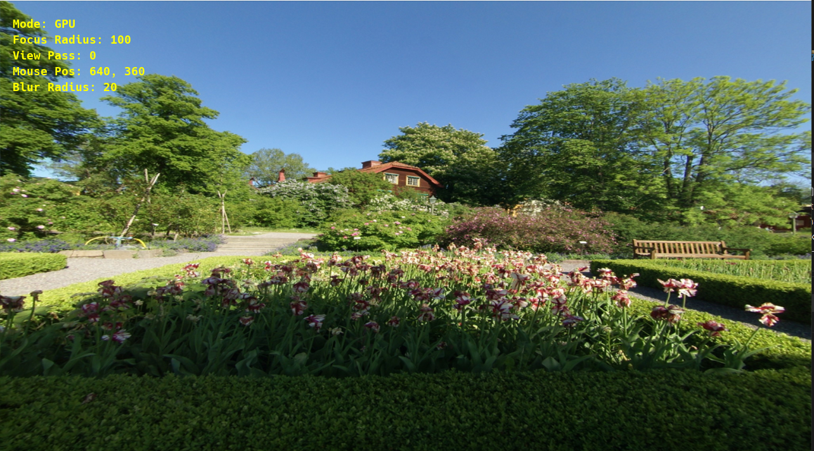
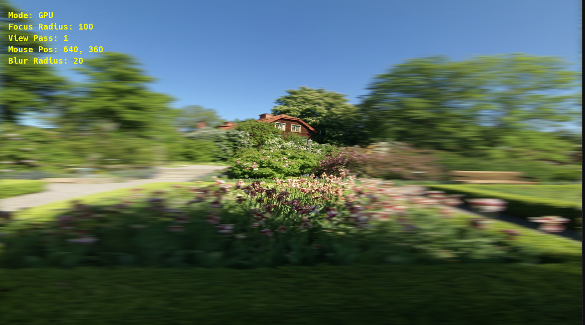
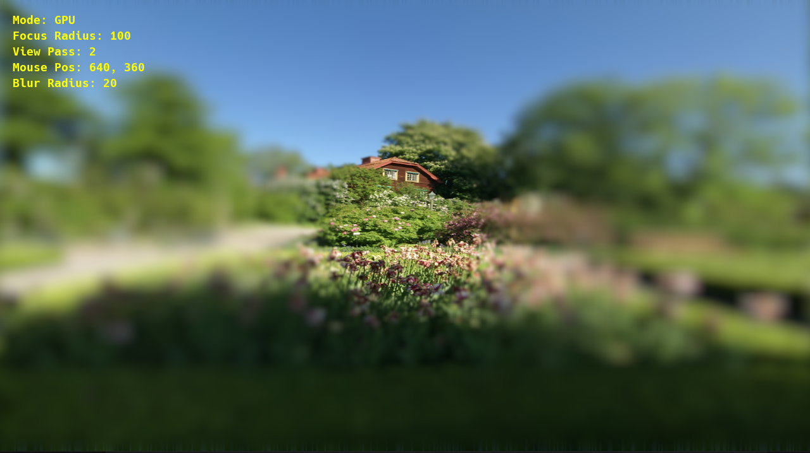
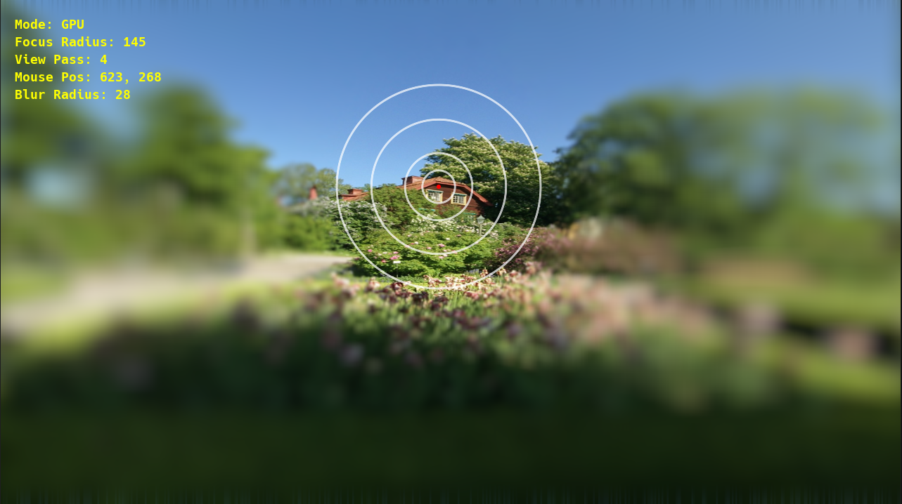
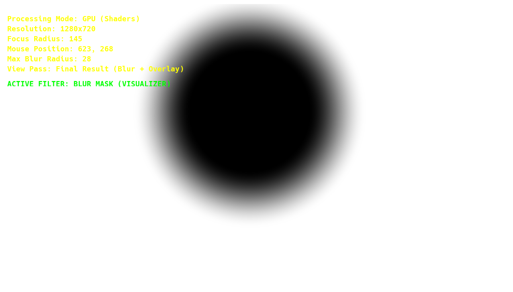
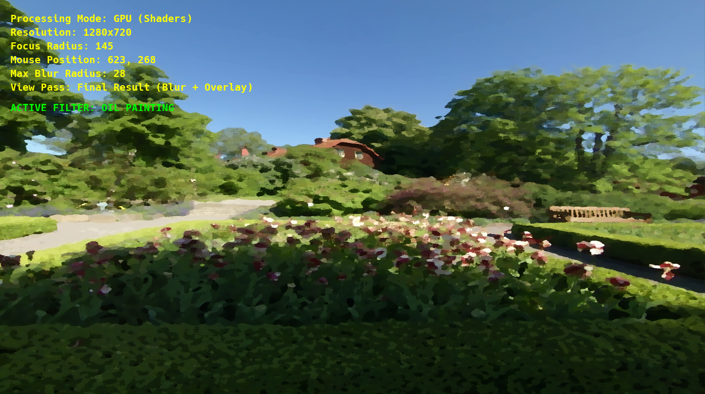
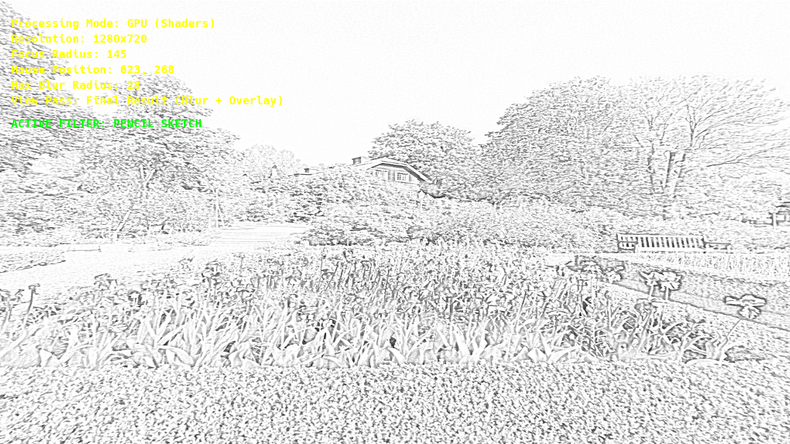
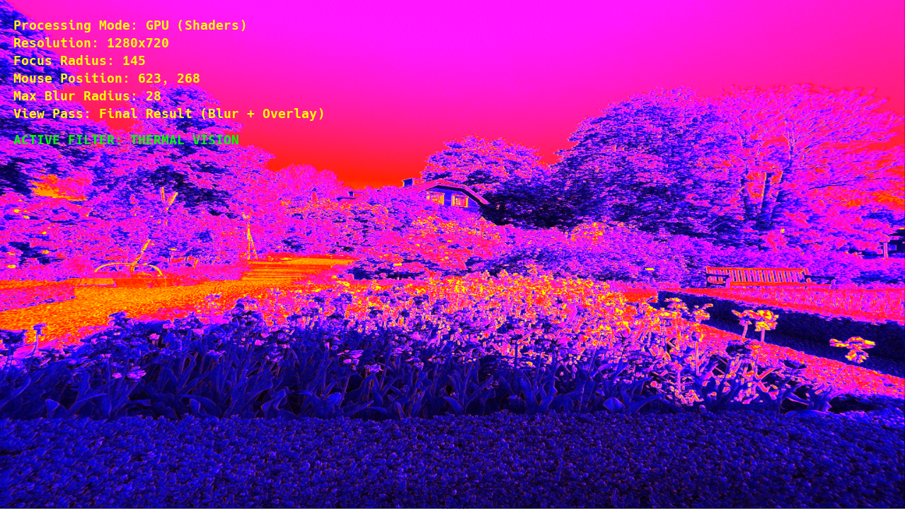
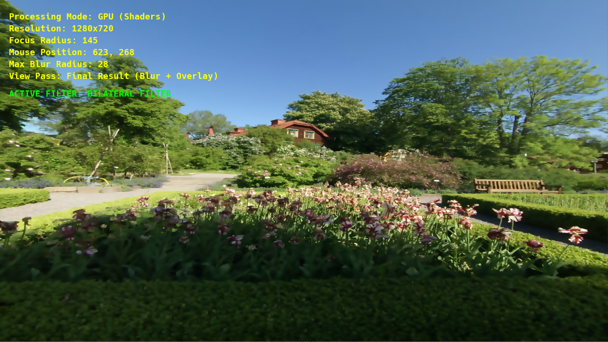
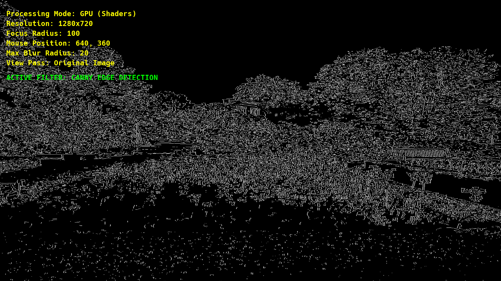

# Tema 2 PGAPI - Bokeh blur (OpenGL & C++)

Acest proiect este o aplicație interactivă de procesare a imaginilor dezvoltată în C++ folosind OpenGL. Permite aplicarea de filtre și efecte complexe asupra imaginilor, atât pe **GPU (Shaders)** pentru performanță maximă în timp real, cât și pe **CPU** (cu variante paralele și optimizate). Piesa centrală este un filtru de blur interactiv, tip "Bokeh" (Focus), controlat cu mouse-ul, alături de o suită de filtre artistice și de analiză a imaginii.

## 📸 Galerie foto

|  |  |
|:---:|:---:|
| *Poza inițială* | *Aplicare blur orizontal (Tasta 1)* |
|  |  |
| *Blur orizontal + vertical (Tasta 2)* | *Afișare zonă circulară fără blur (Tasta 4)* |
|  |  |
| *Afișare zonă de blur alb-negru (Tasta 5)* | *Oil painting (Tasta 6)* |
|  |  |
| *Pencil sketch (Tasta 7)* | *Thermal vision (Tasta 8)* |
|  |  |
| *Filtru bilateral(Tasta 9)* | *Filtru Canny (Tasta D)* |
---

## Funcționalități Principale & Bonusuri

* **Procesare Duală (CPU/GPU):** Comutare în timp real între procesarea pe placa video (folosind *Compute Kernels* simulate prin shadere) și pe procesor.
* **Blur Interactiv (Bokeh Effect):** Un efect de profunzime de câmp controlabil cu mouse-ul. Zona din jurul cursorului rămâne clară, în timp ce restul imaginii este blurată progresiv folosind o sumă de două distribuții Gaussiene pentru un efect de lentilă realist.
* **Optimizare CPU (Circular Separable Convolution / SAT):** Implementare separată pe CPU ce folosește tabele de sume parțiale (Summed Area Table - SAT) pentru a obține un blur rapid, cu complexitate $O(1)$ pe pixel, independent de raza blur-ului.
* **Canny Edge Detection:** Un algoritm complet de detecție a marginilor (Grayscale -> Gaussian Blur -> Sobel -> Non-Maximum Suppression) implementat interactiv.
* **Galerie de Filtre Artistice:**
  * **Oil Painting (Pictură în Ulei):** Efect pictural bazat pe analizarea frecvenței intensităților locale.
  * **Pencil Sketch (Schiță în Creion):** Efect de desen realizat prin Color Dodge Blending între imaginea grayscale și inversul ei blurat.
  * **Thermal Vision (Viziune Termică / Heatmap):** Mapare de culori falsă (Albastru -> Magenta -> Roșu -> Galben) cu evidențierea strălucitoare a marginilor.
  * **Bilateral Filter:** Un blur care păstrează marginile ascuțite (Edge-Preserving), calculând ponderea pixelilor vecini atât în funcție de distanța spațială, cât și de diferența de culoare.
* **Afișare Mască Blur:** Posibilitatea de a vizualiza masca de ponderare (alb/negru) folosită pentru efectul de focus.
* **In-App File Dialog:** Încărcare dinamică a propriilor imagini (PNG, JPG, BMP) folosind `portable-file-dialogs`.
* **HUD Interactiv:** Afișare pe ecran a stării curente a programului (mod de procesare, rază focus, filtre active etc.).

---

## Controale și Interacțiune

* **Mouse Left-Click (Hold):** Mută zona de claritate (focus) pe imagine.
* **`F`** - Deschide dialogul pentru a încărca o imagine nouă.
* **`E`** - Comută modul de procesare între GPU (Shaders) și CPU.
* **`Q`** - Comută între algoritmul de Blur Standard (Paralel) și cel Rapid (SAT) pe CPU.
* **`T`** - Afișează / Ascunde textul cu informații (HUD).

### Setări Blur & View:
* **`0`** - Vizualizare imagine originală.
* **`1`** - Vizualizare Pass 1 (Blur Orizontal).
* **`2`** - Vizualizare Pass 2 (Blur Vertical).
* **`4`** - Comută vizualizarea rezultatului final (Blur + zona clară originală).
* **`5`** - Vizualizează masca (alb/negru) a zonei de blur.
* **`Săgeată Sus` / `Săgeată Jos`** - Mărește / Micșorează intensitatea (raza) blur-ului global.
* **`+` / `-` (Numpad sau =/-)** - Mărește / Micșorează raza zonei clare (Focus Radius).

### Filtre Speciale:
* **`D`** - Activează/Dezactivează detecția marginilor (Canny Edge Detection).
* **`6`** - Efect de Pictură în Ulei.
* **`7`** - Efect de Schiță în Creion.
* **`8`** - Viziune Thermal / Heatmap.
* **`9`** - Filtru Bilateral (Blur ce păstrează marginile).

---

## Detalii Tehnice

* **OpenGL Framebuffers (FBO):** Implementarea pe GPU folosește tehnici de *Ping-Pong Rendering*. Blur-ul Gaussian este separat în două treceri (Pass 1: Orizontal, Pass 2: Vertical) folosind două FBO-uri cu texturi de tip `GL_RGBA16F` pentru a preveni pierderea preciziei datelor.
* **OpenMP:** Variantele algoritmilor de pe CPU folosesc directive `#pragma omp parallel for` pentru a distribui calculul pe mai multe thread-uri.
* **Corecție Gamma:** Calculele pentru blur-ul de pe CPU se fac în spațiu liniar (conversie în/din Gamma 2.2) pentru a asigura un amestec corect și fizic plauzibil al culorilor, evitând efectele de "întunecare" la marginile contrastante.
